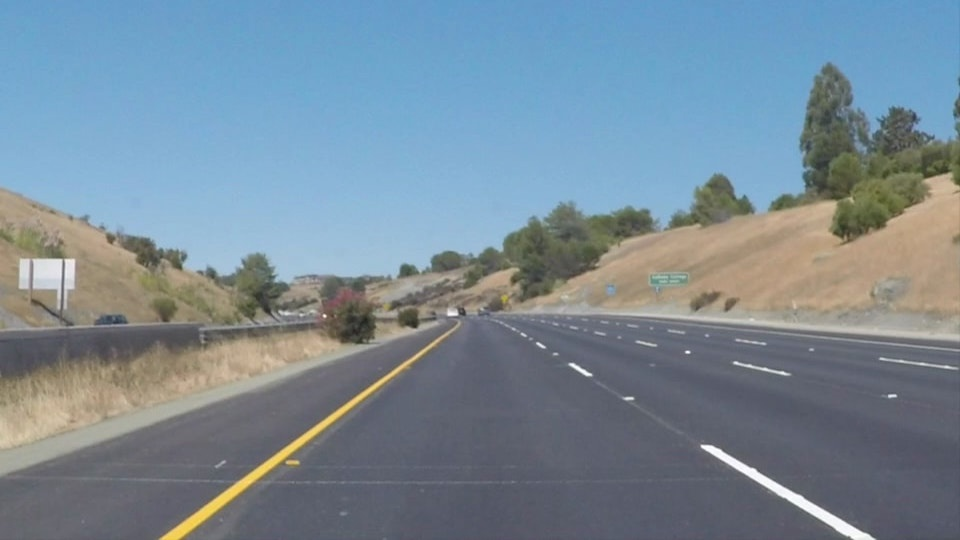
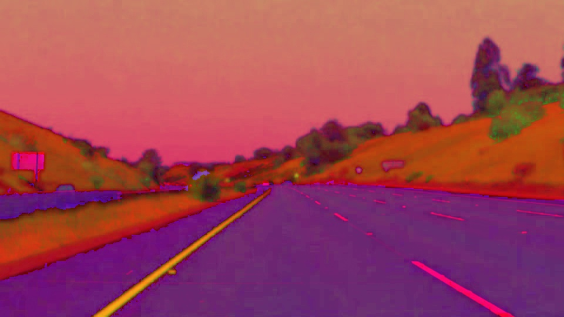
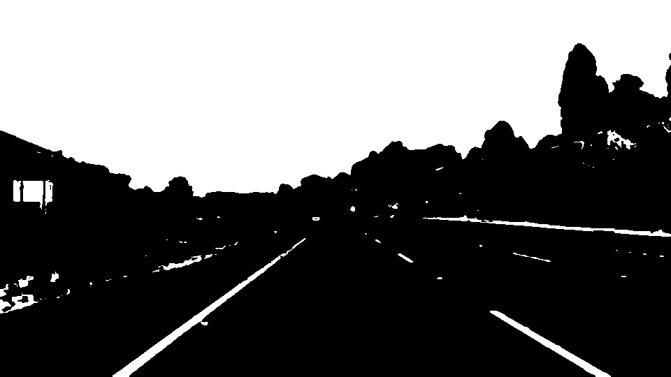
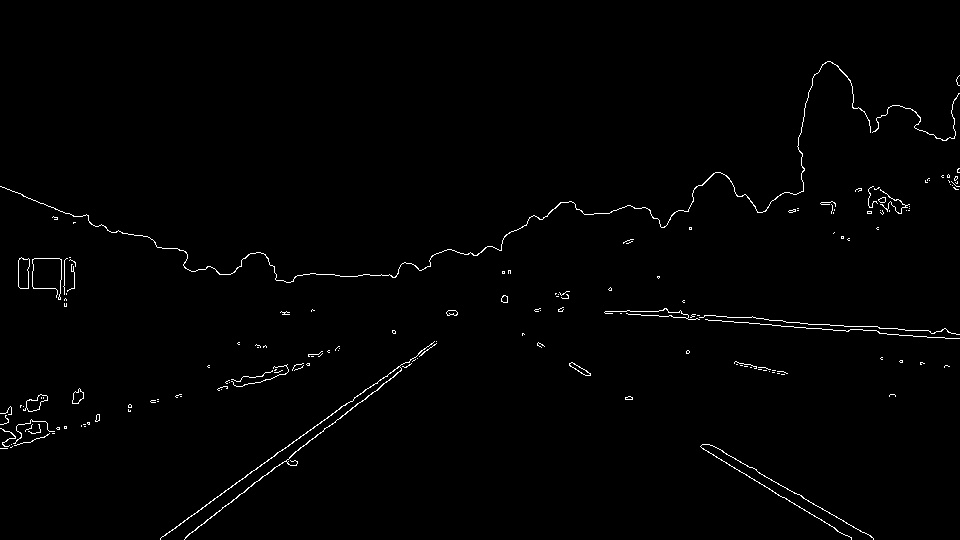
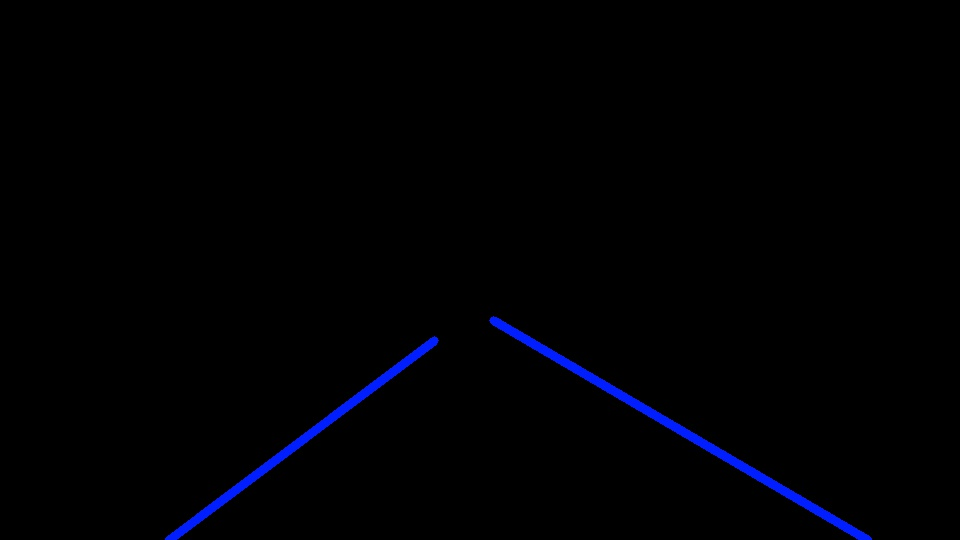

# **Finding Lane Lines on the Road** 

*Vefak Murat Akman*

---


**Finding Lane Lines on the Road**

Create a pipeline which can find lanes on highway.
OpenCV functions are used in this project

Here a example image from highway




---

### Reflection

My pipeline consisted of 5 steps. 

**1)** Convert to HSV: In order to perform color filtering.

**2)** Color filtering: Both yellow and white are masked. Lanes colors may be white or yellow.

**3)** Combining: Two color masked image are created after filtering. Need combine them to get one.

**4)** Canny Edge Detector: Finds edges by using Canny Algorithm.

**5)** Find Lanes using Hough: Hough Lines method is used the lanes in image.











**Hyperparameters**
```python

#GAUSSIAN 
KERNEL_SIZE = 5

#CANNY EDGE // RATIO 1:3
LOW_THRESHOLD = 50
HIGH_THRESHOLD = 150

#MASKING

IMG_WIDTH= img.shape[0]
IMG_HEIGHT= img.shape[1]
vertices = np.array([[(0,IMG_WIDTH),(440, 320), (480, 320), (IMG_HEIGHT,IMG_WIDTH)]], dtype=np.int32)

#HOUGH PARAMETER
RHO = 2 
THETA = np.pi/180 
THRESHOLD = 50    
MIN_LINE_LENGTH = 40 
MAX_LINE_GAP = 200   


#HSV Color Ranges
YELLOW_LOW = np.array([ 20, 100, 100])
YELLOW_HIGH = np.array([ 50, 255, 255])

WHITE_LOW  = np.array([  20,   0,   180])
WHITE_HIGH = np.array([ 150,  255, 255])
```


